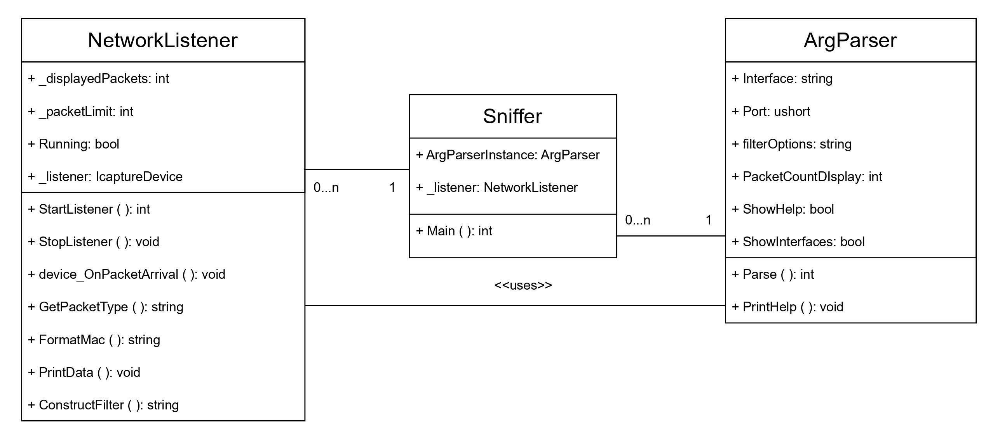

# IPK Project #2 - ZETA: Network sniffer

This documentation describes the implementation of the [IPK project #2](hhttps://git.fit.vutbr.cz/NESFIT/IPK-Projects-2024/src/branch/master/Project%202/zeta). This project was implemented in C# and is designed for a Linux enviroment, but also functions on a Windows environment.
## Program Structure

The program consists of these files:

- `Program.cs` - Sniffer class - starting point of the client
- `ArgParser.cs` - ArgParser class - parser for CLI arguments
- `NetworkListener.cs` - NetworkListener class - prints received packets

The program structure is further depicted in the [class diagram](#class-diagram)

## Implementation details

The sniffer's entry point is the `Main` function in `Program.cs`. An instance of ArgParser handles the CLI arguments and saves the parsed values into its class fields. If the parsing was successful, the `StartListener` function is called.

NetworkListener first constructs a filter based on the CLI arguments. The filter is then passed to an instance of `ICaptureDevice` (imported from the `SharpPcap` library), which is then opened and it starts listening for incoming packets. The main function stays in a while loop until the displayed packets limit is reached, or the user terminates the application with Ctrl+C.

The `OnPacketReceived` function is responsible for handling received packets. It is subscribed to the `OnPacketArrival` event, which causes it to be called every time a packet is captured. The received packets are parsed with `PacketDotNet`'s `Packet.ParsePacket` function and then further processed to extract all relevant data. If the packet is of type 'IcmpV6', it's exact type (MLD or NDP) is further determined by the helper function `GetPacketType`, which inspects the `IcmpV6Packet`'s `Type`. In case of any other packet, it's type is simply determined by the `IPPacket`'s class's function `Protocol`.

For each packet, only non-null attributes are printed to console, and the data content is formatted into a block by the `PrintData` function.

## Build Instructions

Building of the ipk-sniffer is done with the `make` command, since a `Makefile` was required for this project. Running the `make` command simply calls the `dotnet build` command and moves the ipk-sniffer executable and other files required for program execution to the root folder.

### Testing

For testing purposes, i created a simple program `PacketSender`, which also utilizes the SharpPcap and PacketDotNet libraries to create and send packets of all types required by the project assignment. The packet type to send is chosen by user input (keys 0-7). Then the received packet can be inspected in ipk-sniffer.

#### Testing scenarios
- read a TCP packet
- read a UDP packet
- read a Icmpv4 packet
- read a Ndp(NeighbourSolicitation) packet (subset of Icmpv6)
- read a Ndp(RouterSolicitation) packet (subset of Icmpv6)
- read a Mld packet (subset of Icmpv6)
- read an Arp packet
- read an Igmp packet

#### Class diagram {#class-diagram}
All the boolean fields representing sniffer filter options in the ArgParser class are included under the `filterOptions`

